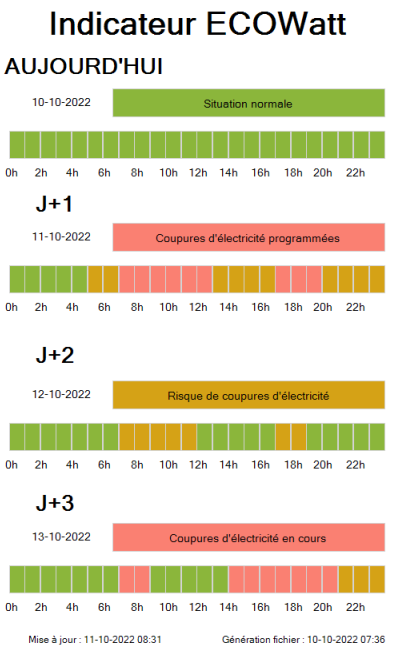
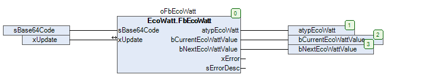

# EcoWatt
Cette bibliothèque CODESYS permet de récupérer les informations du signal EcoWatt fournies par RTE. 

Créer un compte sur https://data.rte-france.com/catalog/-/api/consumption/Ecowatt/v4.0
S'abonner à l'API EcoWatt. 
Dans "mes applications", Cliquer sur Copier en base 64 pour récupérer l'identifiant. 
Le renseigner au niveau de sBase64Code.
Lorsque xUpdate est activé, la requête de récupération du jeton est effectué, puis la requête de récupération des données. 
xUpdate retombe à FALSE lorsque la requête est effectuée ou si il y a une erreur.

Les valeurs numériques retournées correspondent aux niveaux suivant : 
 - 1 ==> Vert : La consommation est normale
 - 2 ==> Orange : le système électrique est tendu : "écogestes" bienvenus.
 - 3 ==> Rouge : le système électrique est très tendu, coupures inévitables si la consommation n'est pas réduite. 
bCurrentEcoWattValue et bextEcoWattValue fournissent la valeur EcoWatt de l'heure en cours et de l'heure suivante. 
Attention à faire en sorte de rafraichir les données périodiquement en activant xUpdate. 
L'API ne peut être appelée que toutes les 15 minutes. Au delà de ce quota, le code HTTP 429 sera renvoyé.